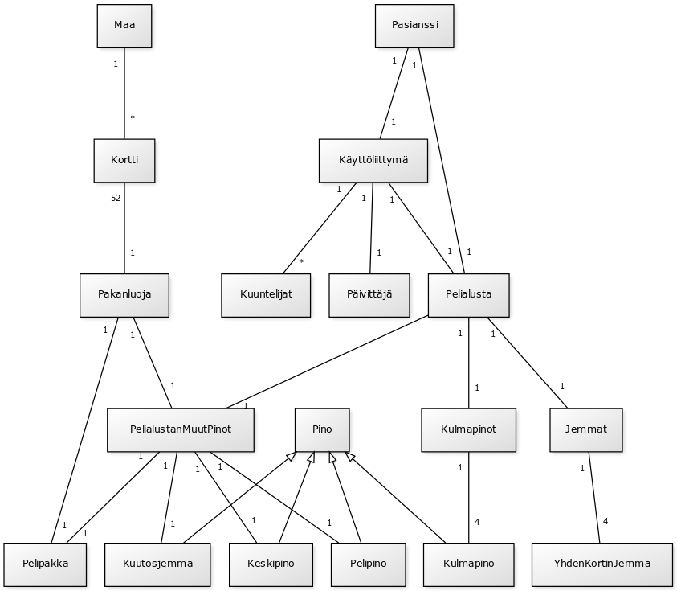

###Aiheen kuvaus ja määrittely

**Aihe:** Pasianssi nimeltä Napoleonin hauta

Kuvaus: Tämäkin pasianssi on yksin pelattava korttipeli. 
Pelissä käydään läpi pakkaa ja asetetaan kortteja pinoihin. 
Ohjelmassa täytyy toteuttaa korttipakka, pelin idea ja käyttöliittymä.

**Pelin kulku:** Pelissä nostetaan pakasta kortti kerrallaan kortteja.
Tavoitteena on pinota kortit viiteen pinoon siten, että yhdessä pinossa
on neljä kertaa kortit 6, 5, 4, 3, 2 ja ässä ja neljässä muussa pinossa
on kortit 7-13. Voitetun pelin jälkeen pinojen päälimmäiset korit ovat
siis neljä kuningasta ja yksi ässä. Pelissä on viisi jemmapaikkaa, joihin
voi laittaa yhden kortin kuhunkin. Yksi jemma on varattu pelkästään kuutosille
ja muihin voi laittaa mitä tahansa kortteja.

**Käyttäjät:** Pelaaja

**Pelaajan toiminnot:**

- Nosta kortti
- Peru nosto
- Aseta kortti jemmaan
- Aseta kortti pinoon
- Aloita uusi peli
- Lopeta peli

.png)
.png)

#### Rakennekuvaus

Ohjelma rakentuu neljällä tasolla. Alimmalla tasolla määritellään kortit ja
pakka. Seuraavalla tasolla määritellään korteista koostuvat pelipinot ja
pelipakka. Kolmas taso kokoaa pelissä käytettävät pinot ja pakan yhteen
sekä määrittelee niiden välisen toiminnallisuuden. Neljäs taso luo ulkoasun,
eli määrittelee käyttöliittymän.
